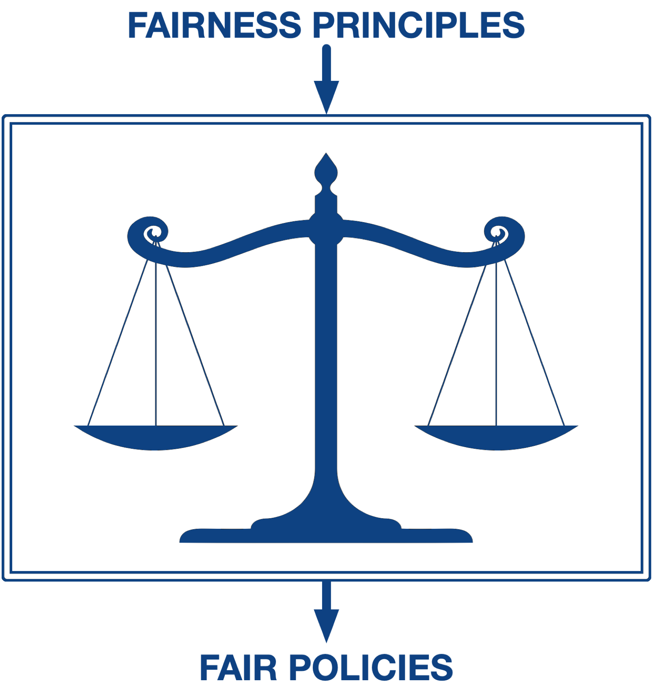

# SCALES

  

This repository is created to distribute the code for the AIES 2022 paper ["SCALES: From Fairness Principles to Constrained Decision Making"]([AIES 2022](https://www.aies-conference.com/2022/aies-2022-accepted-papers/)). The final code will be udpated after the AIES conference in August 2022. Meanwhile, kindly contact [Sreejith Balakrishnan](mailto:sreejith@comp.nus.edu.sg) for any queries on the code or the paper. 

## Motivation
Traditional AI decision making systems are tasked with optimizing a narrow performance criteria. We argue that these systems should go beyond this and take into consideration broader societal concerns such as fairness.

## Challenges
A key challenge that arises when you try to incorporate fairness into decision making is that multiple fairness principles are applicable to a given scenario.

Let us consider an example. 

  

Shown here is a casual model employed by a fictitious government to decide whether or not to subsidize the healthcare of a citizen. The government’s decision to subsidize the healthcare benefits the citizen, but comes at an added expense to the government. In this setup, we assume Gender is a sensitive attribute.

If we were to task a group of policy makers to come up with fair policies in this setup, it is more than likely that there will be disgreements. Some may prefer fairness at an individual level, such as counterfactual fairness while other might approach it from a group level, such as group fairness. Some may prioritize fairness in the decisions while others look for fairness in the outcomes that result from these decisions. To make matters worse, while each of the policy maker might have an intuition of the behavior of the fair policy, they might be completely off and the actual behavior of the fair AI system might not match their intentions. 

To mitigate these issues, we need a decision making framework that uses a common language to translate fairness principles into optimal decisions so that the behavior of the generated policy can be analyzed before implementing at scale.

##SCALES
SCALES is a fair decision making framework that can incorporate various fairness principles in to decision making in a standard manner. 

In SCALES, we model the decision making problem as a variant of the constrained markov decision process that we call SCMDP. The key realization (change) behind this work is that fairness principles can be broken down into a combination of three components. 

  

The utility component influences the objective function to be optimized when generating decisions. A good example of this is the Maximin principle which maximizes the worst case utility among stakeholders. 

The non-causal and causal components are constraints that restricts the space of policies. The non-causal component can be calculated from the trajectory data of the given policy. You can find this component in distributive fairness settings where the trajectory data tells you how fairly a particular resource is distributed. The causal component requires an understanding of the causal mechanism involved in decision making. This component is commonly found in path specific fairness and counterfactual fairness. 

Once these components are identified, they can be mapped to the elements of an SCMDP and fair decisions can be generated through constrained optimization. 

## Results
We observed interesting insights from the decisions generated by SCALES in our case studies. For instance, in the healthcare subsidy setting, we noticed unexpected behavior where tightening fairness constraints resulted in subsidies being denied for everyone.  When extending this to a sequential decision making system, we encountered the problem of temporal fairness where we noticed a significant difference in policies when fairness is imposed at each timestep vs across the trajectory. Finally, our case study on the real world COMPAS dataset showed that simply removing the sensitive attribute from the dataset might not be the best fair policy. Please see our paper for a detailed analysis of the results.
